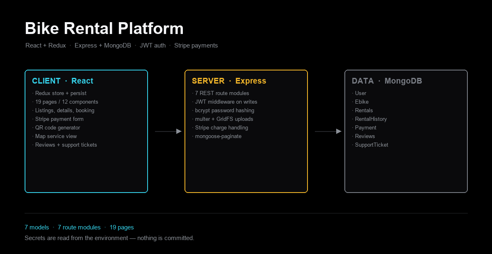

<p align="center">
  
</p>

<h1 align="center">Bike Rental Platform</h1>

<p align="center">
  A full-stack e-bike rental service — browse, book, pay, and manage the rental
  afterwards. React and Redux on the front, Express and MongoDB behind it.
</p>

<p align="center">
  
  
  
  
  
  
</p>

---

## What it does

An e-bike rental marketplace with two sides to it. A renter registers, browses
listings by category, opens a bike, books it for a period and pays. An owner
lists their own bike, sets a price, and manages what comes in. Around that sit
the parts a rental service actually needs once it is real: rental history,
reviews, and a support ticket queue with responses.

- **Accounts** — register and log in, edit a profile, upload an avatar
- **Listings** — create a listing with photos, browse by category, view details
- **Booking** — reserve a bike for a date range, see it in your rental list
- **Payments** — Stripe checkout against the booking
- **After the rental** — history, reviews you can write and read back
- **Support** — raise a ticket, track it, respond on a thread

## How it is put together

**Client** — React with a Redux store that persists, so a half-finished
booking survives a refresh. Nineteen pages and a dozen shared components:
listing cards, a map view, a Stripe payment form, a QR code generator.

**Server** — Express with seven route modules, one per domain (`auth`,
`ebikes`, `rental`, `payment`, `review`, `support`, `user`). A single JWT
middleware guards every write path. Passwords are hashed with bcrypt and never
stored or logged in the clear. Image uploads go through multer into GridFS
rather than sitting on the application server's disk.

**Data** — seven Mongoose models. `RentalHistory` is kept separate from
`Rentals` on purpose: an active booking and a completed one are read very
differently, and splitting them keeps the hot query small.

## Configuration

Nothing secret is committed. The server reads its configuration from the
environment — copy the example and fill in your own values:

```bash
cp server/.env.example server/.env
```

```
MONGO_URL=            # your MongoDB connection string
JWT_SECRET=           # any long random string
STRIPE_SECRET_KEY=    # sk_test_… from your own Stripe dashboard
```

## Running it

```bash
# server
cd server && npm install && npm start

# client, in a second terminal
cd client && npm install && npm start
```

The client comes up on `http://localhost:3000` and talks to the server on its
configured port.

## Repository layout

```
client/
    src/pages/          19 screens — listings, booking, profile, reviews, tickets
    src/components/     listing cards, map, payment form, QR, navbar
    src/redux/          persisted store
server/
    models/             User · Ebike · Rentals · RentalHistory · Payment · Reviews · SupportTicket
    routes/             auth · ebikes · rental · payment · review · support · user
    middleware/auth.js  JWT verification
```

---

**Parth Sharma** — AI Engineer, chatbots and RAG systems
[byparth.in](https://byparth.in) · [hello@byparth.in](mailto:hello@byparth.in)
